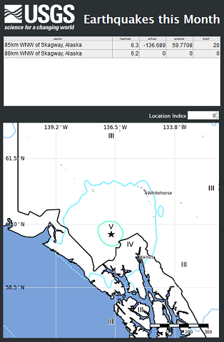

# Call 3rd Party Web Service
This example uses the WebVI to call the [Earthquake API](https://earthquake.usgs.gov/) from the [US Geological Survey](https://www.usgs.gov/) and display recent earthquakes on a webpage.

On the block diagram it uses [HTTP GET](http://zone.ni.com/reference/en-XX/help/371361N-01/lvcomm/http_client_get/) to query for earthquakes in the last 30 days and [Unflatten from JSON](http://zone.ni.com/reference/en-XX/help/371361N-01/glang/unflatten_from_json/) to convert the results to LabVIEW data.

On the front panel it displays a summary of the results in a data grid indicator and shows a map of the selected earthquake region in a URL Image indicator.

# Dependencies
- LabVIEW NXG 2.0 Beta

# Setup
- Clone the [ni/webvi-examples](https://github.com/ni/webvi-examples) repo to your machine.
- Open `Call 3rd Party Web Service/Call 3rd Party WebService.lvproject`
- Run the WebVI
  - Open **Main.gviweb** and click the **Run** button
- Build Web application
  - Open WebApp.gcomp
  - Switch to the **Document** tab
  - Click Build

# Details
A web service is a collection of functions that can be called through the web to trigger behavior or return data. Many websites offer these APIs as a way for 3rd party developers to build new applications using the website's underlying data or functionality.

Many web services are open and public like the Earthquake API. Others require registration and API keys to restrict access to specific users and to limit the load on the service.

To call a web service in the WebVI, we use the `HTTP Get` VI, passing in the URL of the service and receiving a string with the result of the call. There are examples of this in several VIs, including `GetRecentEarthquakes.gviweb`.

Web services return data in a variety of formats like JSON, XML, CSV, and YML. The USGS Earthquake service uses JSON, which LabVIEW is able to parse using `Unflatten from JSON`. We must specify the structure the data is expected to take and can also provide a path to limit the search to a specific part of the data. There are examples of this in several VIs, including `Get Earthquake Count.gviweb`.

If the web service returns data in a format other than JSON, we can still extract it in the WebVI using functions from the String palette. There is an example of this in `Get Map URL.gviweb`.

Once the data has been retrieved and converted into LabVIEW types, we display it on the Top Level WebVI panel, `Main.gviweb`, using indicators from the panel palettes. This example uses a data grid to show all earthquakes and a URL Image to display the map of the surrounding area.

