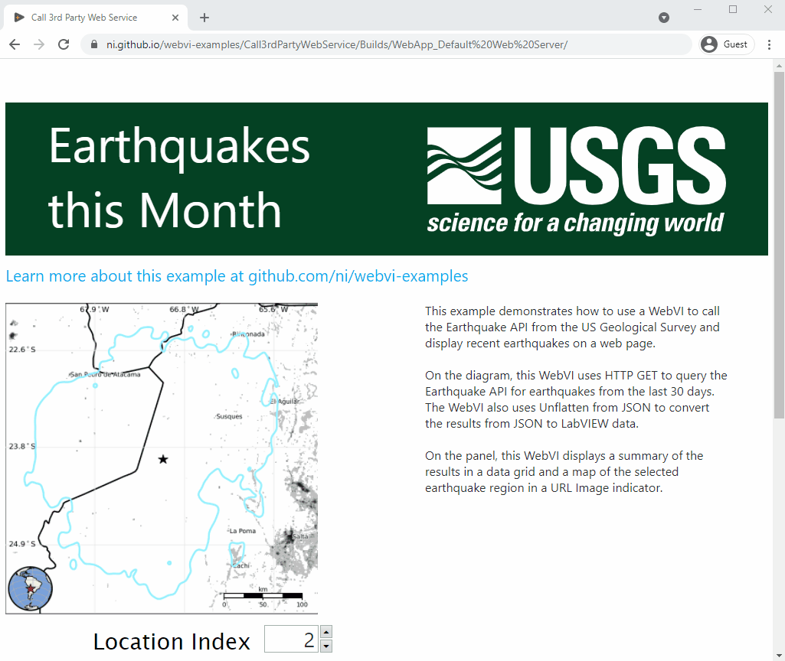
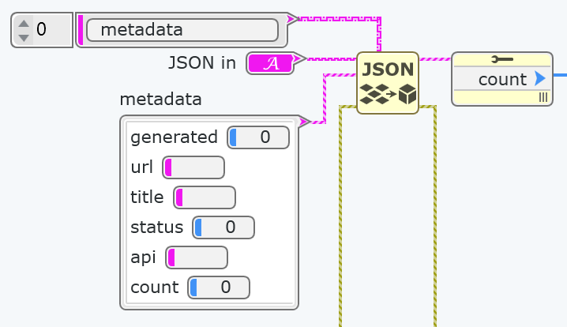

# Call 3rd Party Web Service

This example demonstrates how to use a WebVI to call the [Earthquake API](https://earthquake.usgs.gov/) from the [US Geological Survey](https://www.usgs.gov/) and display recent earthquakes on a web page.

On the diagram, this WebVI uses [HTTP GET](https://www.ni.com/documentation/en/g-web-development/latest/node-ref/get/) to query the Earthquake API for earthquakes from the last 30 days. The WebVI also uses [Unflatten from JSON](https://www.ni.com/documentation/en/g-web-development/latest/node-ref/unflatten-from-json/) to convert the results from JSON to LabVIEW data.

On the panel, this WebVI displays a summary of the results in a data grid and a map of the selected earthquake region in a URL Image indicator.

## Dependencies

- G Web Development Software

## Setup

1. Clone the [ni/webvi-examples](https://github.com/ni/webvi-examples) repository to your machine.
2. Open `Call3rdPartyWebService/Call3rdPartyWebService.gwebproject`
3. Open `index.gviweb` and click the **Run** button.
4. Build the web application.  
  a. Open `WebApp.gcomp`.  
  b. On the **Document** tab, click **Build**.
    - To view the build output on your machine, click **Output Directory** on the **Document** tab once your application finishes building.
    - To launch and view the Web Application locally you can use the **Run** button on the **Document** tab.

## Hosting

You can manually move the build output found at `\Call3rdPartyWebService\Builds` to any web server.

This project also includes a Distribution (`WebApp.lvdist`) that can be used to build a package (`.nipkg`). Packages utilize NI Package Manager to automated the process of installing, upgrading, or removing the web app. A package is also a requirement for [hosting a Web application with the Web Applications service](https://www.ni.com/docs/en-US/bundle/g-web-development/page/hosting-a-web-vi.html).

Leveraging the [Web Applications service](https://www.ni.com/docs/en-US/bundle/g-web-development/page/hosting-a-web-vi.html) is the recommended way to host a WebVI as it enables permissioned access and configurable security settings. Other options for hosting a WebVI can be found in the [Hosting a Web Application on a Server](https://www.ni.com/docs/en-US/bundle/g-web-development/page/hosting-web-application-on-server.html) topic. 

## Details

A web service is a collection of functions that can be called through the web to trigger behavior or return data. Many websites offer these APIs as a way for third-party developers to build new applications using the website's underlying data or functionality.

Many web services are open and public like the Earthquake API. Others require registration and API keys that restrict access to specific users and limit the load on the service.

To call a web service in a WebVI, this example uses the `HTTP Get` node to pass in the URL of the service and return a string with the result of the call. There are examples of this in several WebVIs, including `GetRecentEarthquakes.gviweb`.

Web services return data in a variety of formats, such as JSON, XML, CSV, and YML. The USGS Earthquake service returns JSON, which LabVIEW can parse using the `Unflatten from JSON` node. To use `Unflatten from JSON`, you must specify the structure the data is expected to take and can provide a path to limit the search to a specific part of the data. There are examples of this in several WebVIs, including `Get Earthquake Count.gviweb`.

If the web service returns data in a format other than JSON, you can still parse it in the WebVI using String nodes. There is an example of this in `Get Map URL.gviweb`.

Once the data has been retrieved and converted into LabVIEW data types, this example displays the data in indicators on the panel of the top-level WebVI, `index.gviweb`. This example uses a data grid to show all earthquakes and a URL Image indicator to display a map of the surrounding area.

