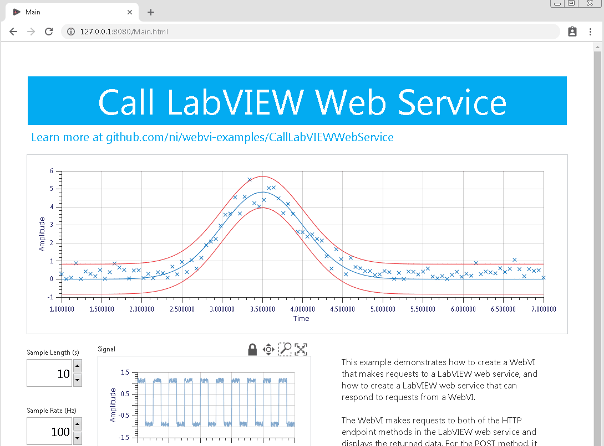

# Call LabVIEW Web Service

__Note: The Call LabVIEW Web Service demo requires the included LabVIEW Web Service to be running locally on your machine.__

This example demonstrates how to create a WebVI that makes requests to a LabVIEW web service, and how to create a LabVIEW web service that can respond to requests from a WebVI.

## Usage

Use LabVIEW to create web services that do what WebVIs can't do, such as:

- Complex data analysis
- Signal processing
- Interacting with hardware
- Reading and writing data to and from file systems and databases

## Dependencies

- G Web Development Software
- LabVIEW 2018 or later

## Setup

1. Clone the [ni/webvi-examples](https://github.com/ni/webvi-examples) repository to your machine.
2. Open `CallLabVIEWWebService\WebService\WebService.lvproj` in LabVIEW.
3. In the **Project Explorer**, right-click **Web Server** and select **Start**.
4. Open `CallLabVIEWWebService\CallLabVIEWWebService.gwebproject` in G Web Development Software.
5. Open `index.gviweb` and click the **Run** button.
6. Build the web application.  
  a. Open `WebApp.gcomp`.  
  b. On the **Document** tab, click **Build**.
    - To view the build output on your machine, click **Output Directory** on the **Document** tab once your application finishes building.
    - To launch and view the Web Application locally you can use the **Run** button on the **Document** tab.

## Hosting

You can manually the move the build output found at `Builds` to any web server. This project also includes a Distribution (`WebApp.lvdist`) that can be used to build a package (.nipkg). Packages utilize NI Package Manager to automated the process of installing, upgrading, or removing the web app. A package is also a requirement for hosting a Web application on SystemLink Cloud.

### SystemLink Cloud Web App Hosting

The following steps can be used to host the web app on SystemLink Cloud

1. Open `CallLabVIEWWebService\CallLabVIEWWebService.gwebproject`.
2. Open `WebApp.lvdist`.
3. Click the build icon in the top command bar of this distribution document
4. Open a Web browser and navigate to https://www.systemlinkcloud.com/webapphosting
5. Click the **Choose nipkg** button and select the nipkg built in step 3.
6. When the upload is complete, click on your newly uploaded Web app from your list of Web apps

### Local Hosting

The following steps can be used to host the web app on a local web server

#### Hosting on the NI Web Server with a nipkg

1. Open `CallLabVIEWWebService.gwebproject`
2. Open `WebApp.lvdist`.
3. Click the build icon in the top command bar of this distribution document
4. Double-click the nipkg and follow the on screen instructions
5. Open a web browser and navigate to `http://localhost:9090/calllvwebservice/`

#### Hosting on the LabVIEW 2009-2021 Web Server

1. Open `C:\Program Files (x86)\National Instruments\Shared\NI WebServer\www`.
2. Copy the `WebApp_Default Web Server` directory into the `www` directory.
3. Open a web browser and navigate to `http://localhost:8080/WebApp_Default%20Web%20Server/`

#### Hosting on the NI Web Server

1. Open `C:\Program Files\National Instruments\Shared\Web Server\htdocs`.
2. Copy the `WebApp_Default Web Server` directory into the `htdocs` directory.
3. Open a web browser and navigate to `http://localhost:9090/WebApp_Default%20Web%20Server/`.

## Details

### Important Directories

- **`Web Service`** &mdash; Contains the LabVIEW web service project.
- **`WebVI`** &mdash; Contains the G Web Development Software web application project, which includes the WebVI.
- **`WebVI/Builds/WebApp_Default Web Server`** &mdash; Contains the built web application, which consists of HTML, JavaScript, the compiled diagram, and other web content.

### The Web Service

The web service is created in LabVIEW and consists of two HTTP endpoint methods (one `GET` and one `POST`) and a few SubVIs.

#### Output Type

You must configure the Output Type correctly in order for a LabVIEW web service to send data to a WebVI.

1. In the **Project Explorer**, right-click **Web Server** and select **Properties**.
**Note:** The Web Server must be stopped before you can edit its properties.
2. On the left navigation menu, select **HTTP Method VI Settings**.
3. Select a Web Service VI from the table and click the **Output Type** tab under **Web Service VI Properties**.
4. Choose one of the following options.  
  a. Option 1 (recommended): Select **Stream** and enable the **Use headers** and **Buffered** checkboxes.
**Note:** This option requires the web service VI to flatten return data to JSON and return it through `Write Response.vi`.
  b. Option 2: Select **Terminal** and select **JSON** as the output format.  
**Note:** This option returns data through VI output terminals and serializes LabVIEW data into JSON automatically.

#### CORS

Cross-Origin Resource Sharing (CORS) allows a Web Service VI to respond to HTTP requests from a different server than where it is hosted. `AddCORSHeaders.vi` adds HTTP headers to allow requests from any origin. This configuration is necessary if your WebVI is not hosted on the LabVIEW web server.

### The WebVI

The WebVI makes requests to both of the HTTP endpoint methods in the LabVIEW web service and displays the returned data. For the POST method, it collects some parameter information from the panel controls and serializes it into the POST buffer.

### Bundling with LabVIEW Web Services

This example show how to include your WebVI as part of your LabVIEW Web service for either Windows or Real-Time and deploy them together. This is advantageous if you want to avoid CORS between your WebVI and Web service in production. This also allows the use of relative URLs on the WebVI block diagram.

#### Project Setup

The `WebApp_Default Web Server` directory has been included as **Public Content** within the LabVIEW project. This was done by right-clicking the Web service in the project and selecting Add **Public Content Folder**. In the **Open** dialog the `WebApp_Default Web Server` directory was selected. This is an *auto populating* folder so changes made by modifying the WebVI and rebuilding the application in G Web Development Software are automatically up taken by LabVIEW project. See more details on this topic at [Integrating Static Content into a Web Service](http://zone.ni.com/reference/en-XX/help/371361N-01/lvhowto/ws_static_content/).

#### URL Configuration Enum

In the WebVI there is a drop down for selecting the URL configuration.

- **Use Absolute URLs and Local Debugging**: This uses fully qualified URLs; e.g. `http://127.0.0.1:8001/Web_Server/ParametricCurve` in each HTTP request. Fully qualified URLs must be used if the Web service access by the WebVI is on a different host than the WebVI itself; e.g. CORS. The Web server here is the **Local Debugging** Web server built into LabVIEW. This is enabled by right-clicking the Web Service in the LabVIEW project and selecting **Start**.
- **Use Relative URLs and Application Web Server**: This uses a relative URLs; e.g. `ParametricCurve` in each HTTP request. The rest of the URL is filled in automatically by the browser. This technique is useful because URLs in code don't need to be changed as the hostname, protocol, or port or the Web service is changed. The Web service and WebVI are deployed to the **Application Web Server** by right-clicking the Web service in the LabVIEW project and selecting **Publish**.
