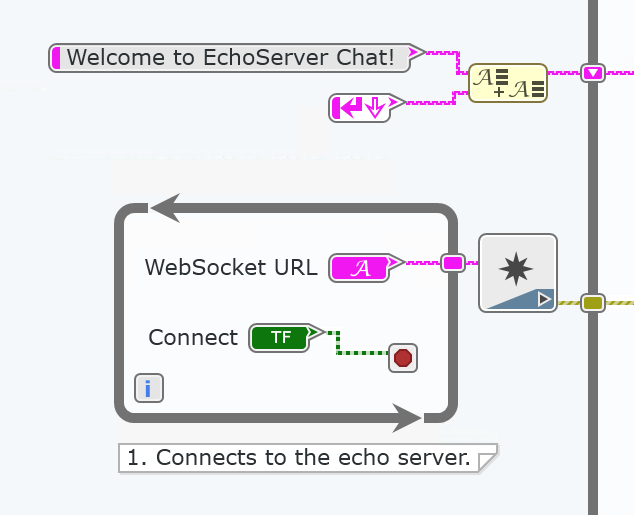
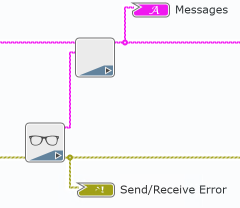

# JSLI WebSocket Echo

This example uses the JavaScript Library Interface (JSLI) to connect to the WebSocket Echo Server hosted by websocket.org. The WebVI connects to the server, sends a message, and receives the same message from the server. The WebSocket functions use an external JavaScript file to implement their functions. 

On the diagram, this WebVI uses JSLI nodes to open a connection to the echo server, send messages, read received messages, close the connection and log debug information to the browser console. The WebVI also formats sent and received strings to display on the Messages indicator.

On the panel, this WebVI displays all sent and received messages in Messages indicator.

# Dependencies
- LabVIEW NXG 3.0 Web Module

# Setup
1. Clone the [ni/webvi-examples](https://github.com/ni/webvi-examples) repository to your machine.
2. Open `JSLIWebSocketEcho\JSLIWebSocketEcho.lvproject`
3. Open `Main.gviweb` and click the **Run** button.
4. Build the web application.  
  a. Open `WebApp.gcomp`.  
  b. On the **Document** tab, click **Build**.

**Note:** To view the build output on your machine, click **Locate Directory in Windows Explorer** on the **Document** tab once your application finishes building. You can automatically launch and view the Web application locally by going to **System Designer** >> **Web Server** >> right-click **WebApp.gcomp** >> **Run**

# Hosting
You can manually the move the build output found at `\JSLIWebSocketEcho\Builds` to any web server. This project also includes a Distribution (WebApp.lvdist) that can be used to build a package (.nipkg). Packages utilize NI Package Manager to automated the process of installing, upgrading, or removing the web app. A package is also a requirement for hosting a Web application on SystemLink Cloud.

## SystemLink Cloud Web App Hosting
The following steps can be used to host the web app on SystemLink Cloud
1. Open `JSLIWebSocketEcho.lvproject`.
2. Open `WebApp.lvdist`.
3. Click the build icon in the top command bar of this distribution document
4. Open a Web browser and navigate to https://systemlinkcloud.com/
5. Click the **Choose nipkg** button and select the nipkg built in step 3.
6. When the upload is complete, click on your newly uploaded Web app from your list of Web apps

## Local Hosting
The following steps can be used to host the web app on a local web server
### Hosting on the NI Web Server with a nipkg
1. Open `JSLIWebSocketEcho.lvproject`
2. Open `WebApp.lvdist`.
3. Click the build icon in the top command bar of this distribution document
4. Double-click the nipkg and follow the on screen instructions
5. Open a web browser and navigate to `http://localhost:9090/JSLI%20WebSocket%20Echo/Main.html`

### Hosting on the NI Web Server by manually moving files
1. Open `C:\Program Files\National Instruments\Shared\Web Server\htdocs`
2. Copy the `WebApp_Web Server` directory into the `htdocs` directory
3. Open a web browser and navigate to `http://localhost:9090/WebApp_Web%20Server/Main.html`

### Hosting on the LabVIEW 2009-2017 Web Server
1. Open `C:\Program Files (x86)\National Instruments\Shared\NI WebServer\www`
2. Copy the `WebApp+Web Server` directory into the `www` directory
3. Open a web browser and navigate to `http://localhost:8080/WebApp_Web%20Server/Main.html`

# Details
The WebSockets are a bidirectional communication protocol that allow interaction between the user's browser and a server. It is defined in Internet Engineering Task Force (IETF) RFC 6455 — The WebSocket Protocol. Most modern browsers support WebSockets.

The JSLI node wraps JavaScript functions in WebSocketWrapper.js, which are then called in LabVIEW.  

This example connects to a public echo server hosted by websocket.org. To connect to the echo server, the WebVI uses OpenWebSocket and passes in the server URI. This example only allows one connection to the Echo server.

Once a connection is established, the user sends messages with the SendMessage function, and the echo server responds with the same message. The onMessage method in WebSocketWrapper.js stores the received messages in memory, and the WebVI polls every 50 ms for new messages with the CheckMessage function.

Additionally, the WebVI does not allow empty messages to be sent. Sent and received messages are formatted in the SubVIs and displayed on the Messages indicator.

  

Once the session is completed, the user disconnects from the server.

# Related Links
WebSockets https://developer.mozilla.org/en-US/docs/Web/API/WebSockets_API/Writing_WebSocket_client_applications  
Window Object https://developer.mozilla.org/en-US/docs/Web/API/Window  
Closure in JavaScript https://developer.mozilla.org/en-US/docs/Web/JavaScript/Closures  