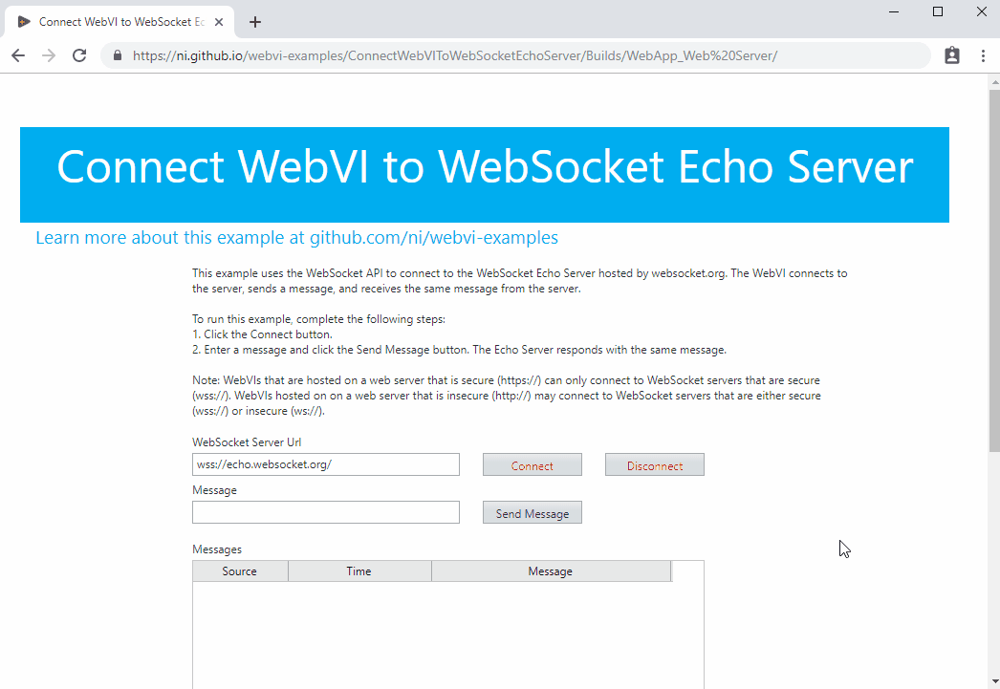
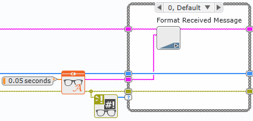

# Connect WebVI to WebSocket Echo Server

This example uses the G Web Development Software WebSockets API to connect to the WebSocket Echo Server hosted by https://ifelse.io/. The WebVI connects to the server, sends a message, and receives the same message from the server.

On the diagram, this WebVI uses WebSocket VIs to open a connection to the echo server, send messages, read received messages, and close the connection. The WebVI also formats sent and received strings to display on the Messages indicator.

## Dependencies

- G Web Development Software

## Setup

1. Clone the [ni/webvi-examples](https://github.com/ni/webvi-examples) repository to your machine.
2. Open `ConnectWebVIToWebSocketEchoServer\ConnectWebVIToWebSocketEchoServer.gwebproject`
3. Open `index.gviweb` and click the **Run** button.
4. Build the web application.  
  a. Open `WebApp.gcomp`.  
  b. On the **Document** tab, click **Build**.
    - To view the build output on your machine, click **Output Directory** on the **Document** tab once your application finishes building.
    - To launch and view the Web Application locally you can use the **Run** button on the **Document** tab.

## Hosting

You can manually move the build output found at `\Call3rdPartyWebService\Builds` to any web server.

This project also includes a Distribution (`WebApp.lvdist`) that can be used to build a package (`.nipkg`). Packages utilize NI Package Manager to automated the process of installing, upgrading, or removing the web app. A package is also a requirement for [hosting a Web application with the Web Applications service](https://www.ni.com/docs/en-US/bundle/g-web-development/page/hosting-a-web-vi.html).

Leveraging the [Web Applications service](https://www.ni.com/docs/en-US/bundle/g-web-development/page/hosting-a-web-vi.html) is the recommended way to host a WebVI as it enables permissioned access and configurable security settings. Other options for hosting a WebVI can be found in the [Hosting a Web Application on a Server](https://www.ni.com/docs/en-US/bundle/g-web-development/page/hosting-web-application-on-server.html) topic. 

## Details

The WebSockets are a bidirectional communication protocol that allow interaction between the user's browser and a server. It is defined in Internet Engineering Task Force (IETF) RFC 6455 — The WebSocket Protocol. Most modern browsers support WebSockets.

This example connects to a public echo server hosted by https://ifelse.io/. To connect to the echo server, the WebVI uses the WebSocket Open VI and passes in the server URL. This example only allows one connection to the Echo server.

Once a connection is established, the user sends messages with the Write String VI, and the echo server responds with the same message. The WebVI polls every 50 ms for new messages with the Read String VI. The Read String VI is configured to timeout if no message becomes available to read after 50 milliseconds.

Additionally, the WebVI does not call Write String VI if Message is empty. Sent and received messages are formatted in the SubVIs and displayed on the Messages indicator.

  

Once the session is completed, the user disconnects from the server.

## Related Links

[WebSockets API Documentation](https://www.ni.com/documentation/en/g-web-development/latest/web-mod-node-ref/websocket-nodes/)
