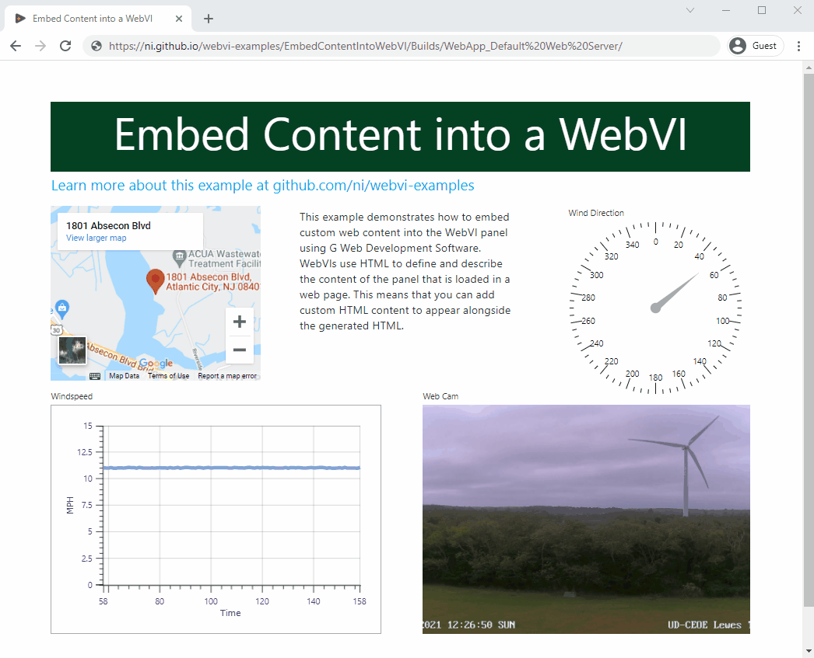

# Embed Content into a WebVI

[](https://ni.github.io/webvi-examples/EmbedContentIntoWebVI/Builds/WebApp_Default%20Web%20Server/)
[]()

This example demonstrates how to embed custom web content into the WebVI panel using G Web Development Software. WebVIs use HTML to define and describe the content of the panel that is loaded in a web page. This means that you can add custom HTML content to appear alongside the generated HTML.



## Dependencies

- G Web Development Software

## Setup

1. Clone the [ni/webvi-examples](https://github.com/ni/webvi-examples) repository to your machine.
2. Open `EmbedWebVIIntoContent/WebVI/Embed WebVI into Content.gwebproject`.
3. On the **Project Files** tab, expand `WebApp.gcomp` and open `index.gviweb`.
4. Click the **Run** button.
5. Build the web application.
  a. On the **Project Files** tab, double-click `WebApp.gcomp` to open the web application component.  
  b. On the **Document** tab, click **Build**.  

## Hosting

You can manually move the build output found at `\Call3rdPartyWebService\Builds` to any web server.

This project also includes a Distribution (`WebApp.lvdist`) that can be used to build a package (`.nipkg`). Packages utilize NI Package Manager to automated the process of installing, upgrading, or removing the web app. A package is also a requirement for [hosting a Web application with the Web Applications service](https://www.ni.com/docs/en-US/bundle/g-web-development/page/hosting-a-web-vi.html).

Leveraging the [Web Applications service](https://www.ni.com/docs/en-US/bundle/g-web-development/page/hosting-a-web-vi.html) is the recommended way to host a WebVI as it enables permissioned access and configurable security settings. Other options for hosting a WebVI can be found in the [Hosting a Web Application on a Server](https://www.ni.com/docs/en-US/bundle/g-web-development/page/hosting-web-application-on-server.html) topic. 

## Details

This section describes the content added to the HTML source of the WebVI to create a web page that shows current weather conditions for Iowa State University. The HTML source can be edited by clicking the `Edit panel HTML` button in the WebVI panel's toolbar.

### Custom iframes

This example uses an `<iframe>` generated from [Google Maps](https://developers.google.com/maps/documentation/embed/guide) was added to show the location of the web cam on a map.

```html
<div>
  <iframe id="map" src="https://www.google.com/maps/embed?pb=!1m18!1m12!1m3!1d3083.9251931399904!2d-74.4527296846353!3d39.380569979499064!2m3!1f0!2f0!3f0!3m2!1i1024!2i768!4f13.1!3m3!1m2!1s0x89c0efaacf825f6f%3A0x6d8892ab37e17426!2s1801+Absecon+Blvd%2C+Atlantic+City%2C+NJ+08401!5e0!3m2!1sen!2sus!4v1502732532752 "width="300" height="250" frameborder="0" style="border:0" allowfullscreen=""></iframe>
</div>
```

### URL Image

The **URL Image** indicator from the **Drawings** palette category allows you to enter a URL to an external image. The **URL Image** supports both static images (`.jpg`, `.png`, etc.) and animated images (`.gif`, etc.).

This example uses the following image URL from the [University of Delaware Public Utilities](https://publicutility.ceoe.udel.edu/lewesturbine/multimedia.shtml#live): `https://ceoe-contrail.ceoe.udel.edu:8100/Mjpeg/1?authToken=d392c0a2-3a6c-4a94-aad8-1c248e44915a`
