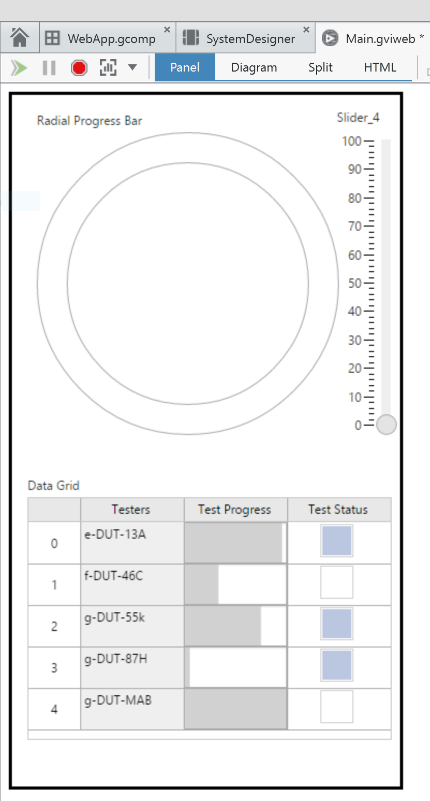

# Embed a WebVI into Web Content
[](https://ni.github.io/webvi-examples/EmbedWebVIIntoContent/)
[](https://github.com/ni/webvi-examples/tree/master/EEmbedWebVIIntoContent)

This example demonstrates how to embed the output of a WebVI built using LabVIEW NXG 2.0 into an static web page.

The build output of a WebVI includes three basic parts:
- HTML5 custom elements
- Compiled WebVI diagram (`.via.txt`)
- JavaScript and CSS files used in the web application

Because WebVIs share the same basic building blocks as other web pages, you can embed WebVI output into any web content.


# Usage
You can use the techniques demonstrated in this example whenever you want to embed a WebVI to an existing web page. For example, you may create educational course material with an embedded WebVI that visualizes data acquired in a lab setting.

# Dependencies
- LabVIEW NXG 2.0 Web Module
- LabVIEW 2009-2017 (Required for hosting only)
- NI SystemLink Server (Required for hosting only)

# Setup
1. Clone the [ni/webvi-examples](https://github.com/ni/webvi-examples) repository to your machine.
2. Open `EmbedWebVIIntoContent/WebVI/EmbedWebVIIntoContent.lvproject`.
3. On the **Project Files** tab, expand `WebApp.gcomp` and open `Main.gviweb`.
4. Click the **Run** button.
5. Build the web application.  
  a. On the **Project Files** tab, double-click `WebApp.gcomp` to open the web application component.  
  b. On the **Document** tab, click **Build**.  

**Note:** To view the build output on your machine, click **Locate Directory in Windows Explorer** on the **Document** tab once your application finishes building. 


## Important Directories
- **`WebVI`** &mdash; The source code of the WebVI and the build output of the web application. Most of the paths and file names are defaults from the **Web Application Project** template in LabVIEW NXG 2.0.
    - **`WebVI/Builds/Web Server/Configuration1/WebApp`** &mdash; The build output of the web application.
- **`StaticPageResources`** &mdash; The HTML and CSS files that define the static web page. This example requires no additional JavaScript.

# Hosting
After building copy and paste the build output at `\EmbedWebVIIntoContents` directory to any web server you want.

## Hosting on the LabVIEW 2009-2017 Web Server
1. Open `C:\Program Files (x86)\National Instruments\Shared\NI WebServer\www`and create directory; for example `webvi-example`.
2. Copy the `EmbedWebVIIntoContents` directory into the `webvi-example` directory.
3. Open a web browser and navigate to `http://localhost:8080/webvi-example/index.html`

## Hosting on the NI Web Server
1. Open `C:\Program Files\National Instruments\Shared\Web Server\htdocs` and create directory; for example `webvi-example`.
2. Copy the `EmbedWebVIIntoContents` directory into the `htdoc\webvi-example` directory.
3. Open a web browser and navigate to `http://localhost:9090/webvi-example/index.html`.  


## Published Example
You can find the fully assembled and hosted web application on [Github Pages]({{site.github.url}}/Embed%20WebVI%20into%20Content/index.html) TODO: Double check link once GitHub pages is up and running.

# Details
The following sections describe how the static web page was built including including how parts of the WebVI are pulled into the page.

## The Basic Structure of the Static Web Page
This page is structured like many common marketing pages.

### Hero and Sections
```html
<div class="section" id="hero">
  <div class="container">
    <h1>WebVI</h1>
  </div>
  <div class="right-content container">
    <div>LabVIEW on the Web</div>
    <div>HTML5 Engineering Custom Elements</div>
    <div>Portable, Embeddable, Web Standards</div>
  </div>
</div>
```
The hero section shown above is structured much like the other sections of the page. The `section` class defines the behavior of the overall row. Within the section, there are one or more containers (usually two or three). Each container is a column of content, such as text, images, HTML elements, and custom elements.

### Flexbox
This page reorganizes content as the viewport changes size. This technique, known as responsive web design, is a common pattern available in many front-end frameworks such as Bootstrap. This example uses the Flexbox Layout module to create a responsive web page.

```css
.section {
  display: flex;
  justify-content: space-around;
  padding-bottom: 5px;
}
```
The CSS rules for the `.section` class define one of the Flexbox containers used throughout the page. The `justify-content` property allows the content within the Flexbox container to wrap differently as the page changes size. In this page, the content is always in a `.container` class.

The content in a `.container` class does not get reorganized as the page changes size, but it does use Flexbox to align and stack its content. Together with the `content-item` or `content-text` classes, each container is a constant 375px width, which is the portrait width of the iPhone 5.

```css
.container {
  display: flex;
  text-align: center;
  flex-direction: column;
  justify-content: center;
}
...
.content-item{
  width: 375px;
  height: 667px;
  margin-top: 5px;
  margin-left: auto;
  margin-right: auto;
}
```

## Authoring the WebVI
This example use LabVIEW's absolute layout system for the controls and indicators and places them within a `.container` class that is positioned relative to the rest of the page content. However, this is not required because the WebVI custom elements can be embedded in a page without an absolute layout.

### Approximating Relative Layout
To provide feedback to the 375px bounds of `.content-item`, a CSS rule has been added to the WebVI using the HTML editor.

```html
<style>
  .front-panel {
    display: inline-block;
    width: 375px;
    height: 667px;
    position: relative;
    overflow: show;
    border-style: solid;
  }
</style>
...
<section id="FrontPanelCanvas" class="front-panel">

```
Once the content is placed within this box and the WebVI is built, we have the correct CSS needed to achieve the same layout within a `.container`.



### Building a web application
Refer to the [Setup](# Setup) section for instructions on building a web application. Building a web application produces the following output:
- `Main.html` &mdash; An HTML representation of the panel, including the CSS that defines the absolute layout of the controls.
- `Main.via.txt` &mdash; The compiled WebVI diagram that can execute in a web browser.

## Copying HTML custom elements, styles, and references into the static web page
This is the most brittle part of the process. If you add, remove, or replace a control on the panel of the WebVI, you must rebuild the web application and copy the HTML output to the static web page again. Changes to the diagram are less brittle because you can refer to the `.via.txt` file using a relative path that does not change when the web application is rebuilt.

### Control custom elements
The following code is the HTML representation of one of the slider controls in `Main.html`.
```html
<jqx-slider data-ni-base-style="uninitialized" ni-control-id='28' binding-info='{"prop":"value","dco":0,"dataItem":"dataItem_Slider","unplacedOrDisabled":false,"sync":false}' label-id='29' value='0' min='0' max='9' interval='1' scale-position='far' ticks-visibility='minor' labels-visibility='all' format='decimal' significant-digits='6' scale-type='floatingPoint' orientation='horizontal'></jqx-slider>
```
This slider contains many properties that are usually set in LabVIEW and not modified once the HTML is built. Each of these elements are copied from `Main.html` and pasted into `index.html`.

```css
jqx-slider[ni-control-id='28'] {
  left: 20px;
  top: 450px;
  width: 250px;
  height: 62px;
  font-size: 12px;
  font-family: Roboto Condensed, sans-serif;
  font-style: normal;
  font-weight: normal;
  text-decoration: none;
}
```

The CSS generated by the built `Main.html` is also copied into `main.css`. This CSS file defines the absolute position, width, and height of each custom element. In this example, `main.CSS` has been slightly modified to fine-tune the appearance of the web page.

### ni-web-application and ni-virtual-instrument custom elements
In order for the WebVI to run in the static web page, the following custom elements must also be copied into the static web page: `ni-virtual-instrument` and `ni-web-application`. These elements are not user-facing, but they define the location of the `.via.txt` and the configuration of Vireo.

The `ni-virtual-instrument` custom element needs no modification after it is built into `Main.html`. However, you do need to update the `vireo-source` property of the `ni-web-application` custom element to reflect the relative path between `index.html` and `Main.via.txt`.

Example:
```html
<ni-web-application engine="VIREO" location="BROWSER" vireo-source="WebVI/Builds/Web%20Server/Configuration1/WebApp/Main.via.txt"><ni-virtual-instrument vi-name="Main.gviweb"></ni-virtual-instrument></ni-web-application>

```
