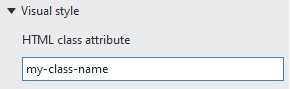

# CSS Frequently Asked Questions

- [What is CSS?](#what-is-css)
- [Will NI maintain a stable set of CSS properties from release to release?](#will-ni-maintain-a-stable-set-of-CSS-properties-from-release-to-release)
- [When should I avoid customizing WebVIs via CSS?](#when-should-i-avoid-customizing-webvis-via-css)
- [How should I include CSS in my project?](#how-should-i-include-css-in-my-project)
- [Why is my WebVI ignoring my CSS?](#why-is-my-webvi-ignoring-my-css)
- [How do I customize a specific control on my WebVI Panel?](#how-do-i-customize-a-specific-control-on-my-webvi-panel)
- [How do I customize a set of controls on my WebVI Panel?](#how-do-i-customize-a-set-of-controls-on-my-webvi-panel)
- [Which CSS properties are known to work?](#which-css-properties-are-known-to-work)

> **Note:** The CSS FAQ covers topics that may require **detailed knowledge of underlying web concepts** or discuss APIs that are unstable and **may change between releases of LabVIEW NXG WebVIs**.

## What is CSS?

It's a textual language used to style an HTML page. It's a deep topic.
But you don't have to understand everything to successfully apply a set of CSS rules to a WebVI Panel.

The understand the basic terminology, consider this CSS example:

```css
p {
    color: red;
}

.my-class {
    color: red;
}
```

In a page with the following HTML:

```html
<p> paragraph one </p>
<p> paragraph two </p>
<span class="my-class my-other-class"> span text </span>
```

### CSS Selectors

In this example, `p` and `.my-class` are called _selectors_. There are many types of selectors.
The `p` selector is called an "element" selector -- it selects all of the `<p>` tags in your HTML and applies the style rules to those tags.

The `.my-class` selector is called a "class" selector. The class that this selector targets is `my-class`.
In the example HTML you can see that the `span` has two classes defined, `my-class` and `my-other-class`.
Notice that the "class" selector starts with **a dot followed by the class name**.

For styling WebVI controls, we recommend setting classes on the controls in the LabVIEW NXG IDE and then using the "class" type selector in your CSS.
Most examples on this page will follow the class selector pattern.

### CSS properties and values

In the CSS, the `color` keyword is called a _CSS property_. There are many, many available properties, often best just explored via the browser Debug tools.
Browser debug tools are launched by opening a page, right clicking an element, and choosing the Inspect command.
`red` is called a _CSS value_. In this case the value will accept specific colors as keywords, hashtag + 6-digits of hex, gradients, [amongst other color representations](https://developer.mozilla.org/en-US/docs/Web/CSS/color).

Those definitions could help you muddle forward. But to really understand what is going on, we suggest you familiarize yourself with CSS as described on the [Mozilla Developer Network](http://digital.ni.com/express.nsf/bycode/exmj34).

## Will NI maintain a stable set of CSS properties from release to release?

No.

Modifying CSS styles from the NI defaults will mean you need to manually update these when upgrading to the next version of the Web Module.
The CSS selectors we are using are not stable from release to release, and we don't update your custom CSS if you were to open your WebVI in a new version of LabVIEW NXG.

## When should I avoid customizing WebVIs via CSS?

In order to keep your panel working the same release to release, you should avoid making customizations via CSS if there is a way to make that same customization via LabVIEW NXG using either:

- The LabVIEW NXG configuration pane UI
- Property nodes can be executed on the diagram to achieve the desired result

## How should I include CSS in my project?

Though it is possible to inline your CSS into the WebVI source HTML, it is better practice to keep your CSS declaration separate from the HTML in separate files with a `.css` file extension.
And then any number of pages can include those styles easily.

In LabVIEW NXG, this means adding `.css` files to your Web Application components in your project and then including `<link>` references in the HTML Source Panel of any VIs that you want to style.
This will cause your WebVI to be styled at all times. You can also do this without editing the HTML Source of a WebVI using a JSLI document, but this is a more advanced technique.

It is common to edit the CSS file outside of the LabVIEW process. If you have edited the CSS while the WebVI panel is open in LabVIEW NXG, the panel will not automatically detect the changes.
We suggest that you make a trivial edit to the HTML source of the WebVI, such as adding/removing a space character, and upon approving that change, the CSS style will be refreshed from the CSS file on disk.
Closing and re-opening the WebVI will also cause it to detect changes to external CSS.

## Why is my WebVI ignoring my CSS?

Let's go down the checklist of what you need to do for a WebVI Panel to pick up on your CSS file:

1. Make a new CSS file on disk, outside of LabVIEW
2. Add the CSS file to you project
3. Ensure that your CSS file is referenced in your Web App component and the box for "always include" is checked.
4. Add a reference from your WebVI to your CSS file by adding this snippet to the HTML source of your WebVI, in the `<head>` section, typically right before the closing `</head>` tag:

   ```html
   <link rel="stylesheet" href="css/style.css">
   ````

5. At this point you should see your style rule applied to the WebVI Panel.

Double-check that the selector in your CSS matches the class name of the control(s) you want to style.

**Note:** The class selectors in your CSS **should** be prefixed with a dot. For example:

```css
.my-class-name {
    /* ... css properties ... */
}
```

While the class attribute in the editor **should not** use the dot prefix. For example:



You can also open your WebVI in a browser and view its source to see if the `<link>` tag is injected correctly
and to verify that the path to the CSS file is correct.

## How do I customize a specific control on my WebVI Panel?

Select a control in the WebVI and configure the HTML class attribute with a `user-class-name` in the LabVIEW NXG IDE.
You cannot use spaces since they are used to separate multiple classes.

Then write some CSS to targets that specific control:

```css
.user-class-name {
    --ni-fill-background: red;
}
```

and be sure to put a `.` on the front of your class name in the CSS selector.

## How do I customize a set of controls on my WebVI Panel?

In the LabVIEW NXG IDE, the `HTML class attribute` field will accept multiple user class names for a given control.
**The class names are delimited by space characters**.

Select each control in the WebVI you want to style similarly and add the same HTML class attribute to each one.
CSS rules targeting that class name will be apply to any the controls in then Panel tagged with the same class name.

## Which CSS properties are known to work?

**Note:** The following CSS selectors and properties are known to work in **LabVIEW NXG 3.1**.

### Configure the Panel background

This property allows you to set colors, gradients, image settings, etc.

```css
ni-front-panel {
    background: #00adef;
}
```

### Put a drop shadow around the Panel edge

```css
ni-front-panel {
    box-shadow: 0px 0px 18px 3px rgba(0, 0, 0, 0.75);
}
```

### Set a repeating image as the Page background (behind the Panel)

```css
body {
    background: #000 url(https://path/to/image.svg) no-repeat left top;
}
```

### Set the minimum width of the Page

```css
body {
    min-width: 400px;
}
```

### Set the minimum width/height of the Panel

```css
ni-front-panel {
    min-width: 1920px;
    min-height: 1040px;
}  
```

### Add 4-pixel border around most controls (not Charts/Graphs)

```css
.user-class-name {
    --ni-border: 4px solid yellow;
}
```

### Round corners on Buttons

```css
.user-class-name button {
    border-radius: 5em;
}
```

### Customize border of buttons

```css
.user-class-name {
    --ni-border: 5px solid;
    --ni-hover-border-color: yellow;
    --ni-border-color: red;
}
```

### Remove border of Charts/Graphs

```css
.user-class-name {
    border:none;
}
```

### Color background of Charts/Graphs or Freeform Text

```css
.user-class-name {
    background: yellow;
}
```

### Color tick labels on Graphs

```css
.user-class-name .flot-x-axis text,
.user-class-name .flot-y-axis text {
    fill: yellow;
}
```

### Color axis label color on Graphs

```css
.user-class-name text.axisLabels {
    fill: yellow;
}
```

### Color the text on String Controls or Indicators

```css
.user-class-name {
    --ni-foreground-color: yellow;
}
```

### Color the text on Numeric Controls or Indicators

```css
.user-class-name {
    --ni-foreground-color: yellow !important;
}
```

### Remove background color from Numeric, String or Timestamp Controls

```css
.user-class-name {
    --ni-control-background-color: transparent;
}
```

### Remove background color from Numeric, String or Timestamp Indicators

```css
.user-class-name {
    --ni-indicator-background-color: transparent;
}
```

### Change background + text color of active tab on a Tab Control

```css
.user-class-name .jqx-ribbon-item.jqx-ribbon-item-selected {
    --ni-control-background-color: #37370e;
    color: white;
}
```

### Hide tab carousel on a Tab Control (rely on programmatic tab switching instead)

```css
.user-class-name .jqx-ribbon-item {
   display: none;
}
```

### Configure the border of _just_ the tab control _container_

```css
.user-class-name {
    --ni-border: var(--ni-border-stroke) var(--ni-border-style) var(--ni-border-color) !important;
}
```

### Tighten up the blank space between all Flexible Layout Containers

```css
ni-flexible-layout-container {
  margin: 0px 0px 0px 0px;
}
```

### Change background or foreground colors on Enums

```css
.user-class-name {
   --ni-selected-background: yellow;
   --ni-selected-foreground-color: red;
}
```

### Make the track on a Slider transparent

```css
.user-class-name .jqx-container .jqx-track::before {
    background: transparent;
    border: none;
}
```

### Change color of the track labels on a Slider

```css
.user-class-name {
    --ni-foreground-color: white !important;
}
```

### Set the fill color on Linear/Circular Progress Bars

```css
.user-class-name {
    --ni-fill-background: yellow;
}
```

### Set the scale color on Tank Controls

```css
.user-class-name {
    --ni-foreground-color: yellow !important;
}
```

### Set color of the thumb on a Vertical Switch

```css
.user-class-name[checked] span.jqx-thumb::after {
   background: yellow;
}
```

### Set the fill color on Gauges

```css
.user-class-name .jqx-value {
    fill: yellow;
}
```

### Set the true/false colors for the Power Button

```css
.user-class-name {
    --ni-true-background: yellow;
    --ni-true-foreground-color: #067bc2;
    --ni-false-background: green;
    --ni-false-foreground-color: white;
}
```

Additional tips can be found in the [product documentation](http://www.ni.com/documentation/en/labview-web-module/latest/manual/customizing-appearance-controls-webvi/) or in the [shipping example that demonstrates CSS styling](../../CustomizeWithCss).
