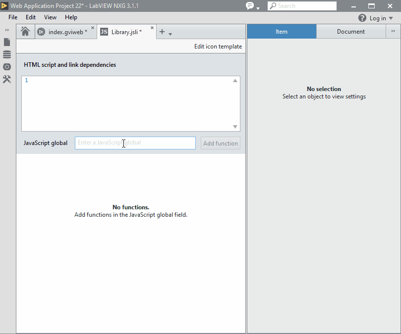
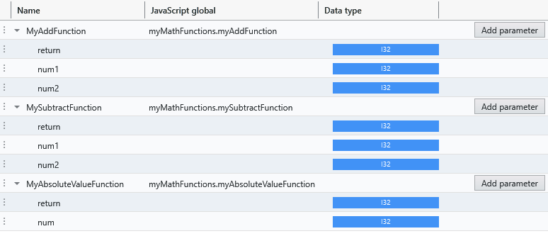

# JSLI Frequently Asked Questions

- [What is the JSLI?](#what-is-the-jsli)

## What is the JSLI?

The JavaScript Library Interface (JSLI) is a document type that allows you to create Block Diagram nodes that call global JavaScript functions in a WebVI.

## Which functions can the JSLI call?

Only functions that are available on the [global object](https://developer.mozilla.org/en-US/docs/Glossary/Global_object) can be called from a JSLI document.

What this means in practice is that **built-in browser JavaScript functions** such as `console.log` may be called directly by a node configured with the JSLI document:



When writing custom JavaScript files, a recommended approach for placing **your JavaScript functions** on the global object is to explicitly set the function on the global object (as opposed to implicitly). In web browsers the global object is named `window` and can be assigned new properties.

For example, the contents of `myJavaScriptFunctions.js` may contain:

```js
window.myAwesomeAdder = function (num1, num2) {
    return num1 + num2;
};
```

A more robust JavaScript file may use the wrapper code template described in the [Preparing Your Code For Use With a JavaScript Library Interface](http://www.ni.com/documentation/en/labview-web-module/latest/manual/prepare-your-js-code/) help topic.

For example, a more complete implementation of `myJavaScriptFunctions.js` using the wrapper code template:

```js
(function () {
    'use strict';

    window.myAwesomeAdder = function (num1, num2) {
        return num1 + num2;
    };
}());
```

The wrapper code template enables strict mode and prevents implicitly placing functions in the global scope. These features of the wrapper code template ensure that functions and variables are not unintentionally exposed on the global object. This avoids situations where you may unintentionally modify another script's functions or variables or another script may unintentionally modify your functions or variables.

For more details about the wrapper code template see the [Preparing Your Code For Use With a JavaScript Library Interface](http://www.ni.com/documentation/en/labview-web-module/latest/manual/prepare-your-js-code/) help topic.

## How can I expose multiple JavaScript functions and minimize global object pollution?

You can combine several JavaScript functions in a **namespace** to prevent polluting the global object. Having fewer functions placed directly on the global object reduces the chance of collisions with other JavaScript functions placed on the global object.

You should choose a namespace name that is unlikely to collide with other JavaScript files that place functions on the global object.

For example, creating a namespace named `myMathFunctions` to add multiple functions:

```js
(function () {
    'use strict';

    const myAddFunction = function (num1, num2) {
        return num1 + num2;
    };

    function mySubtractFunction (num1, num2) {
        return num1 - num2;
    }

    const myAbsoluteValueFunction = num => Math.abs(num);

    window.myMathFunctions = {
        myAddFunction,
        mySubtractFunction,
        myAbsoluteValueFunction
    };
}());
```

The functions in the `myMathFunctions` namespace can be configured in the JSLI document as follows:


## What LabVIEW types are supported by the JSLI?

Only the following LabVIEW types are supported by the JSLI:

- Number, Boolean, String
- Array of Number

For Number, only the following types are supported:

- I8, I16, I32, U8, U16, U32
- Single, Double

Notably, number types I64, U64, Complex, and Fixed-Point are not supported by the JSLI.

## How are the LabVIEW types represented in JavaScript?

### LabVIEW Boolean

The LabVIEW boolean type will be automatically converted to the JavaScript boolean type.

### LabVIEW Number

The various LabVIEW number types will be automatically converted back and forth to the single JavaScript number type.

> **Note**: JavaScript has a single number type that corresponds to an IEEE 754 Double precision floating point value. The JSLI only supports LabVIEW number types that can be losslessly converted to a JavaScript number.

### LabVIEW String

A LabVIEW string will be automatically converted back and forth to the JavaScript string type. This will convert LabVIEW NXG UTF-8 strings to the JavaScript UTF-16 like strings and vice-versa.

> **Note**: Do not attempt to send arbitrary binary back and forth as strings. Instead use byte arrays. Invalid LabVIEW strings or JavaScript strings may result in invalid sequences being replaced or errors.

### LabVIEW Number Arrays

The supported LabVIEW number arrays are passed to and from JavaScript as the corresponding JavaScript TypedArrays. JavaScript TypedArrays are used over ordinary JavaScript Arrays as the TypedArray variants give very good performance characteristics.

For example: A LabVIEW U8 Array would be passed to JavaScript as a Uint8Array.

> **Note**: When passing a LabVIEW numeric array as a TypedArray parameter to a JavaScript function, **DO NOT** hold onto and read from the TypedArray after the completion of the JavaScript function (synchronously or asynchronously). The TypedArray may be a view directly to the run-time memory and may not be valid after the JavaScript function has completed.
>
> **Note**: When passing a LabVIEW numeric array as a TypedArray parameter, only read from the array. **DO NOT** write to the array. The TypedArray may be a view directly to the run-time memory and may have undefined behavior if written to.

## How can I return multiple values from JavaScript?

Use JSON.

## How can I wait for an asynchronous JavaScript function?

If a function returns a Promise then LabVIEW NXG will wait for the Promise to resolve.

JavaScript has several patterns for asynchronous behavior.

### Promises

Returns the promise directly

### Async functions

Mark the function async. JavaScript will create a Promise for you.

### Callbacks

Wrap a callback as a Promise

## How do you hold onto a JavaScript Object reference?

Create a reference manager to manage the JavaScript object references for you.

### How do you construct a JavaScript Object?

Create a wrapper function to invoke the constructor. Use the JavaScript Object reference pattern to hold onto it for you.

### How do you invoke a method of a JavaScript Object?

Create a wrapper function to invoke the method. Use the JavaScript Object reference pattern to hold onto it for you.

## How do you place a custom visual on a WebVI?

Add a class to a text control.
Find the control using JavaScript.
Replace the content of the control.
Note: This is a workaround. Behavior of text control may change between releases.

## How do you queue events or messages?

Use cases: listening for events that fire multiple times or streaming data over a custom protocol.
Use DataQueue pattern.
Actually should use Writeable Stream and polyfill: https://streams.spec.whatwg.org/#example-ws-no-backpressure
