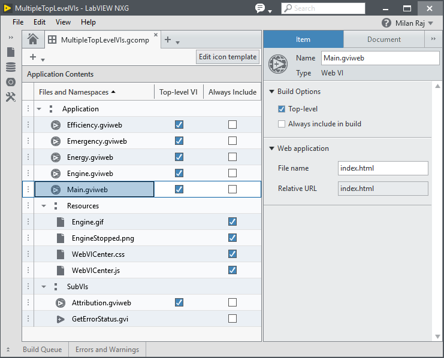

<!-- The following should be equivalent to the section in webvi-examples/Readme.md -->
# Multiple Top-Level VIs

This example demonstrates usage of multiple Top-Level VIs in a NXG Component.
Each Top-Level VI is built into a separate HTML file and the Hyperlink control is used to create clickable links between the different Top-Level VIs.
The example determines the correct url to use for a hyperlink by examining the Relative URL property available for each item in the Component.

# Dependencies
- LabVIEW NXG 2.0 Beta
- LabVIEW 2009-2017 (Required for hosting only)
- Skyline (Required for hosting only)

# Setup
- Clone the [ni/webvi-examples](https://github.com/ni/webvi-examples) repo to your machine.
- Open Multiple Top-Level VIs\Multiple Top-Level VIs.lvproject
- Run the Web VI
  - In the **Project Files** tab expand **WebApp.gcomp**
  - Open **Main.gviweb** and click the **Run** button
      _Note: In the LabVIEW NXG Beta 2.0 Release clicking links to another Top-Level VI in a component will cause the WebVI to open in an external browser but the WebVI will not run_ <!-- TODO DE12694: Pressing run and clicking link to other top-level panel opens a link to broken web vi stuck in synchronization mode -->
- Build Web application
  - Open **WebApp.gcomp**
  - Switch to the **Document** tab
  - Click Build

# Hosting
Place the entire `MultipleTopLevelVIs` directory built under `Builds/Web Server/Configuration1/` to any Web server of your choosing.
## Hosting with LabVIEW 2009-2017 Web Server
1. Open `C:\Program Files (x86)\National Instruments\Shared\NI WebServer\www`
2. Copy the `MultipleTopLevelVIs` directory into the `www` directory
3. Open a Web Browser and navigate to `http://localhost:8080/MultipleTopLevelVIs/index.html`

## Hosting with Skyline Web Server
1. Open `C:\Program Files\National Instruments\Shared\Web Server\htdocs`
2. Copy the `MultipleTopLevelVIs` directory into the `htdocs` directory
3. Open a Web Browser and navigate to `http://localhost/MultipleTopLevelVIs/index.html`

# Details
Each of the Top-Level VIs will create a corresponding HTML page where the organization of those pages is determined by position in the Component.
As can be seen in the following screenshot you have the ability to change the generated File Name for each VI as well as a seeing the Relative URL used for linking.

Notice how it is not required for Top-Level VIs to be at the root of the namespace.
For example, the `Resources/Attribution.gviweb` file is marked as Top-Level and has a Relative URL of `Resources/Attribution.html`.

Also notice how the Main.gviweb file has the File Name set to `index.html` rather than `Main.html`.
This was done as many static Web Servers will automatically serve files named `index.html` when a directory is requested which makes for cleaner urls.
For example, on a compatible web server a user can visit `www.example.com/MultipleTopLevelVIs/` or `www.example.com/MultipleTopLevelVIs/index.html` to see the same page.
