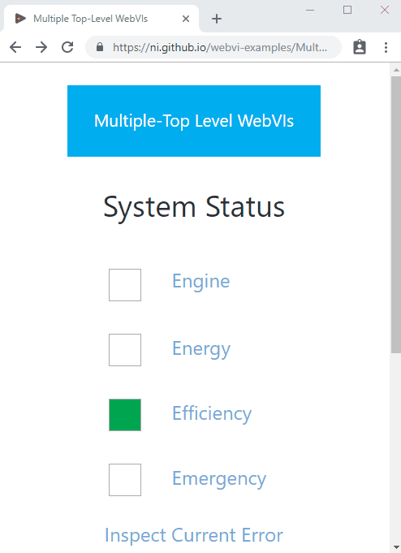

# Multiple Top-Level WebVIs

This example demonstrates how to create a web application with multiple pages by using multiple top-level WebVIs and Hyperlink controls to link between them. When you build the web application, each top-level WebVI generates a separate HTML file with links to the other HTML files that are generated.

## Dependencies

- G Web Development Software

## Setup

1. Clone the [ni/webvi-examples](https://github.com/ni/webvi-examples) repository to your machine.
2. Open `MultipleTopLevelVIs/MultipleTopLevelVIs.gwebproject`
3. On the **Project Files** tab, expand `WebApp.gcomp` and open `index.gviweb`
4. Click the **Run** button.
5. Build the web application.  
  a. On the **Project Files** tab, double-click `WebApp.gcomp` to open the web application component.  
  b. On the **Document** tab, click **Build**.  
    - To view the build output on your machine, click **Output Directory** on the **Document** tab once your application finishes building.
    - To launch and view the Web Application locally you can use the **Run** button on the **Document** tab.

## Hosting

You can manually the move the build output found at `\MultipleTopLevelVIs\Builds` to any web server. This project also includes a Distribution (`WebApp.lvdist`) that can be used to build a package (.nipkg). Packages utilize NI Package Manager to automated the process of installing, upgrading, or removing the web app. A package is also a requirement for hosting a Web application on SystemLink Cloud.

### SystemLink Cloud Web App Hosting

The following steps can be used to host the web app on SystemLink Cloud

1. Open `MultipleTopLevelVIs.gwebproject`
2. Open `WebApp.lvdist`
3. Click the build icon in the top command bar of this distribution document
4. Open a Web browser and navigate to https://www.systemlinkcloud.com/webapphosting
5. Click the **Choose nipkg** button and select the nipkg built in step 3.
6. When the upload is complete, click on your newly uploaded Web app from your list of Web apps

### Local Hosting

The following steps can be used to host the web app on a local web server

#### Hosting on the NI Web Server with a nipkg

1. Open `MultipleTopLevelVIs.gwebproject`
2. Open `WebApp.lvdist`
3. Click the build icon in the top command bar of this distribution document.
4. Double-click the nipkg and follow the on screen instructions.
5. Open a web browser and navigate to `http://localhost:9090/incorporateuserresources/`

#### Hosting on the LabVIEW 2009-2021 Web Server

1. Open `C:\Program Files (x86)\National Instruments\Shared\NI WebServer\www`
2. Copy the `WebApp_Default Web Server` directory into the `www` directory.
3. Open a web browser and navigate to `http://localhost:8080/WebApp_Default%20Web%20Server/`

#### Hosting on the NI Web Server

1. Open `C:\Program Files\National Instruments\Shared\Web Server\htdocs`
2. Copy the `WebApp_Default Web Server` directory into the `htdocs` directory.
3. Open a web browser and navigate to `http://localhost:9090/WebApp_Default%20Web%20Server/`

## Details

### File Name and Relative URL

Each of the top-level WebVIs generates a corresponding HTML file. The organization of the generated HTML files mirrors the hierarchy of WebVIs marked as top-level in the `WebApp.gcomp` file.

On the **Item** tab, you can change the file name for each WebVI and view the relative URL used for linking.

### Top-level WebVIs can be in any part of the namespace

Top-level WebVIs do not need to be at the root of the namespace. For example, `SubVIs/Attribution.gviweb` is marked as top-level and has a relative URL of `SubVIs/Attribution.html`.
