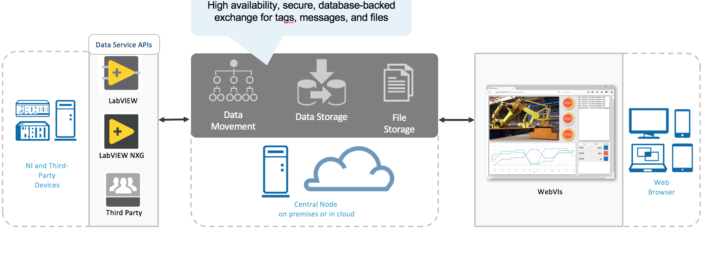
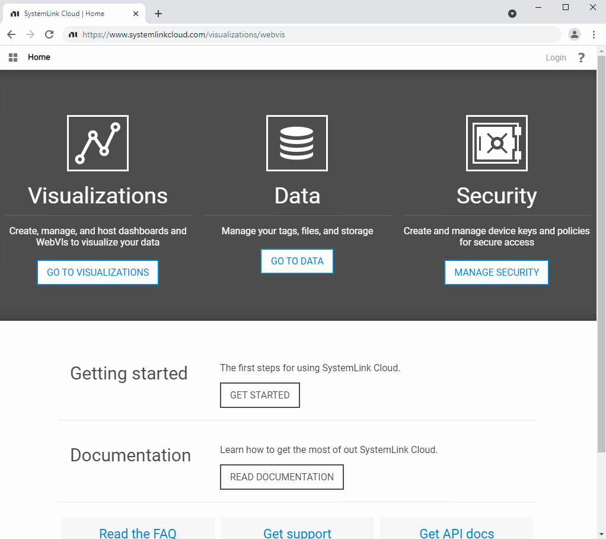
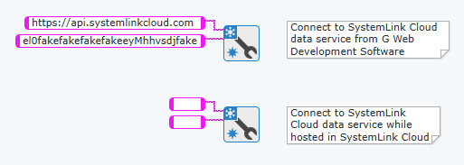
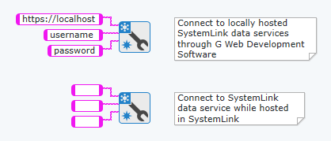

# Call SystemLink Data Services

This example demonstrates how to use a WebVI to communicate over networks with SystemLink Tags after connecting to SystemLink Cloud or SystemLink Server, an on-premises web server.  

Once you complete the necessary steps, you will know:

- How to set up, build, and host web applications.
- How to set up and connect to SystemLink Cloud or SystemLink Server, an on-premises web server.

## Interacting with the Web Application

From the panel of the web app, you will be able to:

- Connect to an on-premises web server or SystemLink Cloud by supplying the required credentials.
- Choose what information is visible by toggling between the Read Tags and Write Tags tabs.
- Determine which state to execute with SystemLink Tags.

_Figure: When hosting a WebVI on the NI Web Server, you do not need to supply credentials again once you logged into the SystemLink web interface._

## Software Requirements

To use SystemLink data services, you need one of the following product combinations:

- G Web Development Software 2021
- LabVIEW 2015-2018 with SystemLink Client 18.0
- LabVIEW 2016-2019 with SystemLink Client 19.5
- LabVIEW 2020 with SystemLink Client 2020 R4
- LabVIEW 2021 with SystemLink Client 2021 R2

Use NI Package Manager to install the products you need. If you do not have NI Package Manager, [download](http://search.ni.com/nisearch/app/main/p/bot/no/ap/tech/lang/en/pg/1/sn/ssnav:dwl/q/ni%20package%20manager/) and install the latest version now.

## Choosing Your Goal

Do you want to learn about connecting your web application to SystemLink Cloud or SystemLink Server? Click one of the following links to jump to your workflow:  

- [I want to connect to SystemLink Cloud](#systemlink-cloud).
- [I want to connect to SystemLink Server](#systemlink-server).
- [I want to learn about the details involved in creating the WebVI](#webvi-details).
- [I want to learn about security](#security).

## SystemLink Cloud

In this section, you’ll learn how to set up, build, and connect your web application to SystemLink Cloud from G Web Development Software.

### What You Need to Connect to SystemLink Cloud from G Web Development Software

To connect your web application to SystemLink Cloud from G Web Development Software, you need a server URL and an API key. The API key authenticates the web application running on your local machine for SystemLink Cloud – much like your ni.com credentials authenticate your identity.

Learn how to [establish a connection to SystemLink Cloud](#connecting-to-systemlink-cloud) from G Web Development Software.

_Figure: Note the input differentiation between connecting to the SystemLink Cloud server from LabVIEW or G Web Development Software vs. hosting your web application on SystemLink Cloud._

### What is an API Key?

An API key authenticates an application trying to access SystemLink Cloud. It helps to think of an API key like login credentials. When you log in somewhere, your username and password authenticate who you are and, if they’re correct, grant you access. An API key functions similarly for your application connecting to the SystemLink Cloud server.

### Obtaining an API Key

1. Go to [Security](https://www.systemlinkcloud.com/security).
2. Click **+ NEW API KEY** to create an API key.
3. Click **Copy key** to save the API key.

>**Note:** You only get to see an API key once, so keep it somewhere safe and only provide it to those you trust. If you delete an API key, all applications using that API key will no longer be able to connect to SystemLink Cloud.

### Connecting to SystemLink Cloud

To connect to SystemLink Cloud from G Web Development Software, you need a server URL and an API key.

1. Go to [Security](https://www.systemlinkcloud.com/security).
2. Click **+ NEW API KEY** button to create an API key.
3. Click **Copy key** to save the API key.
   >**Note:** You will only see the API key once, so keep it somewhere safe.

4. Open G Web Development Software and create a WebVI.
   >**Tip:** Use the Web Application Project template to easily create a WebVI. Navigate to the **Projects** tab and click **Web Application Project** to launch it.

5. Go to the diagram and navigate to **Data Communications»SystemLink»Configuration**.
6. Select the **Open Configuration** node and drag it to the diagram.
7. In the **Function configuration** dialog box of the Open Configuration node, select **API Key**. Changing the configuration of this node enables you to establish a connection with SystemLink Cloud.
   >**Note:** You can also change the Function configuration in the **Item** tab of the Configuration pane.

8. Provide the copied API key as the **api key** and enter `https://api.systemlinkcloud.com` as the **server url**.

### Running the Example Web application

1. Open the **Call SystemLink Data Services** example in G Web Development Software.
   - You can search for it by name in the search bar or navigate to **Learning»Examples»Programming WebVIs»Call SystemLink Data Services** to launch it.
   - Alternately, clone the [ni/webvi-examples](https://github.com/ni/webvi-examples) repository to your machine to use the latest version of this example. [Go here](https://help.github.com/articles/cloning-a-repository/) if you’re new to cloning repositories on GitHub.
2. Open `index.gviweb` and click **Run**.

### Cloud Hosting Overview

After you create a web application and build the package in G Web Development Software, you need to deploy it to a web server so that others can access it using a web browser.

To upload a WebVI to SystemLink Cloud, you will need to build it into a package file, which can be uploaded to SystemLink Cloud. This project includes a distribution document (`Full Data Services App.lvdist`), which can be used to build a package (`.nipkg`).

1. On the **Projects Files** tab, double-click the `Full Data Services App.lvdist` to open it.
2. On the **Document tab**, click **Build** to build the package.

 See [packaging an application](https://www.ni.com/documentation/en/g-web-development/latest/manual/distributing-app-lib/) if you’re interested in learning more about distributing applications.

### Hosting a Web Application on SystemLink Cloud

For SystemLink Cloud to host your web application, use your ni.com credentials for authentication.
>**Note:** Leave the **api key** and **server url** inputs empty to minimize security vulnerabilities.

1. Click **File»New»Distribution**. The Distribution document opens and appears in the project.
2. On the **Document** tab, select **Web Server** as the Build target.
3. For the **Output** type, select **Package**.
4. In the **Distribution** document, click the **Add Application/Library** button.
5. In the **Add Application/Library** dialog box, place a checkmark next to the application or library you want to distribute and click **OK**.
6. On the **Document** tab, enter values in **Company** and **Product**.
7. In **Output** path, set the location to save the distribution output.
8. In the **NI Package** section, enter information about the distribution output.
9. Click **File»Save** all to save all files.
10. Click **Build distribution**. The Build Queue tab shows the status of the build process.
11. Open a web browser and go to [Web apps](https://www.systemlinkcloud.com/webapphosting).
12. To upload your web application, click **Choose .NIPKG** and select the package you just built.
13. Once the upload is complete, click on your web app to interact with it.

## SystemLink Server

In this section, you’ll learn how to set up, build, and connect your web application to the SystemLink Server, an on-premises web server.

### What You Need to Connect to the SystemLink Server from G Web Development Software

_Figure: Note the input differentiation between connecting to an  on-premises server from G Web Development Software vs. hosting your web application on the NI Web Server._

To connect to the [SystemLink Server](http://www.ni.com/documentation/en/systemlink/latest/manual/manual-overview/) from LabVIEW or G Web Development Software, you must include a **server url** (i.e. `https://systemlinkcloud.com`), a **username**, and a **password**. The username and password can be managed with the NI Web Server Configuration utility. This utility can be used to create new users and groups as well as leverage existing LDAP or Windows user accounts.  

When a web application is hosted on the SystemLink Server, leave the **server url**, **username**, and **password** inputs empty to minimize security vulnerabilities.
>**Note:** If you use your own web server, you will need to include your credentials for SystemLink Cloud or SystemLink Server to authenticate the data services in the web application.  

### Setting up an On-Premises Web Server

After installing G Web Development Software, you need to install and configure a SystemLink Server. SystemLink Server includes NI SystemLink Web Application.

1. Launch NI Package Manager.
2. Search for and install SystemLink Server.
3. Launch NI SystemLink Web Application. NI Web Server Configuration launches automatically.
   >**Note:** If the NI Web Server Configuration doesn't launch automatically, follow this path: `C:\Program Files\National Instruments\Shared\Web Server Config`.

4. Follow the prompts in the NI Web Server Configuration to choose the following configuration options:
   1. On the **Select Preset** tab, select **Simple Local Access** configuration preset.
   2. On the **Authentication** tab, check **Login using Windows accounts**.
      > **Note**: This makes the user an admin for SystemLink data services. It also makes the user an admin for Windows.

   3. On the **Administrators** tab, ensure **Add the local Windows Administrators group to the admins role** is selected.
   4. On the **HTTP Port** tab, set the **Server HTTP Port**.
      > **Note**: This example assumes port 9090 is chosen.

   5. On the **CORS** tab, ensure **Enable CORS for web servers running on the same machine as clients** is selected.
   6. On the **Summary** tab, review your selections and then click **Finish**.

### Building and Running the Example Web application

1. Open the **Call SystemLink Data Services** example in G Web Development Software.
   - You can search for it by name in the search bar or navigate to **Learning»Examples»Programming WebVIs»Call SystemLink Data Services** to launch it.
   - Alternately, clone the [ni/webvi-examples](https://github.com/ni/webvi-examples) repository to your machine to use the latest version of this example. [Go here](https://help.github.com/articles/cloning-a-repository/) if you’re new to cloning repositories on GitHub.

2. Open `index.gviweb` and click **Run**.
3. On the **Projects Files** tab, double-click the `Full Data Services App.gcomp` to open it.
4. On the **Document tab**, click **Build** to build your web application.
    - To view the build output on your machine, click **Output Directory** on the **Document** tab once your application finishes building.
    - To launch and view the Web Application locally you can use the **Run** button on the **Document** tab.

### Hosting Overview

After you create a web application and build the package in G Web Development Software, you need to move it to a web server. This enables administrators to access it from a web browser. Copy your entire web application output directory to any web server you choose.
> **Note:** To navigate to your web application output on your machine, click **Locate directory in Windows Explorer** on the **Document** tab of your web application component document. You can also access the build output by navigating to your web application’s project folder manually (`..\CallSystemLinkDataServices\Builds`).

Furthermore, this project includes a distribution document (`Full Data Services App.lvdist`), which you can use to build a package (`.nipkg`). A package is also required for hosting a web application on SystemLink Cloud. See [packaging an application](https://www.ni.com/documentation/en/g-web-development/latest/manual/distributing-app-lib/) to learn more about distributing applications.

### Local Hosting

Follow the instructions below to host the web app on a web server.

### Hosting a Package File (.nipkg) on the NI Web Server

1. Open `CallSystemLinkDataServices.gwebproject`
2. Open `Full Data Services App.lvdist`.
3. Click the **Build distribution**.
   > **Note**: The button looks like a hammer.

4. Click **Locate item in Windows Explorer** to find the build output.
5. Double-click the package (`.nipkg`) and follow the on-screen instructions.
6. Open a web browser and navigate to `http://localhost:9090/CallSystemLinkdataservices/`.

#### Hosting on the LabVIEW 2009-2021 Web Server

1. Go to the LabVIEW Web Server directory using the following path: `C:\Program Files (x86)\National Instruments\Shared\NI WebServer\www`.
2. Copy the entire `Full Data Services App_Web Server` directory into the `www` directory of the LabVIEW web server.
3. Open a web browser and navigate to `http://localhost:8080/Full%20Data%20Services%20App_Web%20Server/`.

#### Hosting on the NI Web Server

1. Go to the NI Web Server using the following path: `C:\Program Files\National Instruments\Shared\Web Server\htdocs`.
2. Copy the `Full Data Services App_Web Server` directory into the `htdocs` directory of the NI Web Server.
3. Open a web browser and navigate to `http://localhost:9090/Full%20Data%20Services%20App_Web%20Server/`.

## WebVI Details

The Call SystemLink Data Services examples uses tags and messages, which are a part of the SystemLink data services API. The Tag API is a highly scalable, lossy network commutation method that utilizes a central node to broker communication between distributed embedded, desktop, and web applications. Use Tags nodes to send and receive measurement data from one system to other systems.

The Message API communicates between systems with strings by publishing messages to topics and allowing subscribers of those topics to receive the messages. The Message API works like a queue. Therefore, if a publisher writes three messages, the subscribers dequeue and read those messages one at a time. Use Messages nodes when you need to send warning messages, status updates, or trigger events from one system to other systems.

Refer to the [SystemLink API Docs](https://www.systemlinkcloud.com/skyline-api-documentation) to find out more about the SystemLink data services API.

- Use the example `index.gviweb` to learn how these APIs can be assembled into an interactive application.
- Use the examples in `Basic Data Services.gcomp` for a simple overview of these APIs.
- Use the LabVIEW examples in the application’s project folder `..\CallSystemLinkDataServices\LabVIEWExamples\LabVIEWExamples.lvproj` to see how you can interact with SystemLink and SystemLink Cloud from LabVIEW and LabVIEW Real-Time.

## Security

For the sake of approachability and learnability this example includes username and password fields on its panel. **We discourage this practice for all applications used in production**.

Additionally, authentication credentials should not be stored in constants on the web application's diagram.  Storing credentials, such as usernames, passwords, or API keys, on the diagram could allow a malicious attacker to retrieve them by accessing the code running in the browser. We encourage you to store your credentials securely on disk but accessible via HTTPS. For example, credentials could be stored in a JSON file within the web server that is also hosting your web application.

If storing credentials in a file is not an option and you need to host your web application on-premises, you may choose to host your web application in the NI Web Server. This requires users to login to the SystemLink Web UI for authentication. Logging into this Web UI stores an authentication cookie in your browser that is automatically sent with calls to SystemLink data services. This eliminates the need to enter a username or password directly to the WebVI, either on its panel or its diagram. To do this, put the built output of your web application into the directory found at `C:\Program Files\National Instruments\Shared\Web Server\htdocs`. This is the directory for all files hosted by the NI Web Server. Please note a user can access the URL of the web application without logging in, but in order to read/write tags, they will have to login to the SystemLink Web UI at `http://localhost:9090`.

If storing credentials in a file is not an option and you can host your web application in the cloud, you may choose to host your web application on SystemLink Cloud. This requires you to have an active SSP for the G Web Development Software and an ni.com account. Doing so allows an authentication cookie in your browser to be automatically sent with calls to SystemLink Cloud. This eliminates the need to enter an API key or server URL either in the web application.
