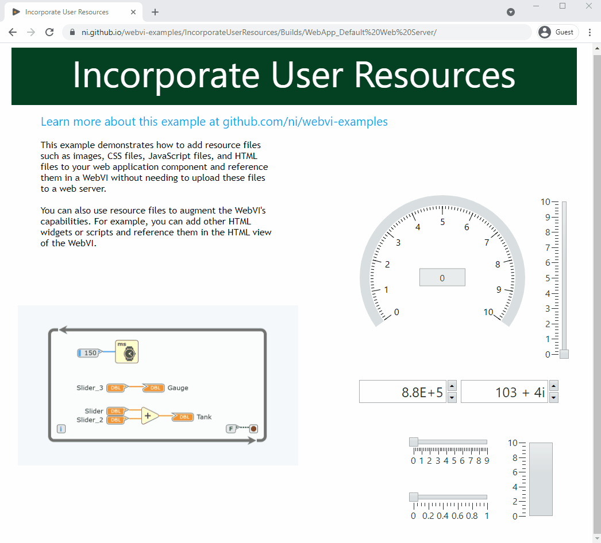

# Incorporate User Resource into WebVI

[](https://ni.github.io/webvi-examples/IncorporateUserResources/Builds/WebApp_Default%20Web%20Server/)
[]()

This example demonstrates how to add resource files such as images, CSS files, JavaScript files, and HTML files to your web application component and reference them in a WebVI without needing to upload these files to a web server.

You can also use resource files to augment the WebVI's capabilities. For example, you can add other HTML widgets or scripts and reference them in the HTML view of the WebVI.



## Dependencies

- G Web Development Software

## Setup

1. Clone the [ni/webvi-examples](https://github.com/ni/webvi-examples) repository to your machine.
2. Open `IncorporateUserResources/IncorporateUserResources.gwebproject`.
3. On the **Project Files** tab, expand `WebApp.gcomp` and open `index.gviweb`.
4. Click the **Run** button.
5. Build the web application.  
  a. On the **Project Files** tab, double-click `WebApp.gcomp` to open the web application component.  
  b. On the **Document** tab, click **Build**.  
    - To view the build output on your machine, click **Output Directory** on the **Document** tab once your application finishes building.
    - To launch and view the Web Application locally you can use the **Run** button on the **Document** tab.

## Hosting

You can manually the move the build output found at `\IncorporateUserResourcest\Builds` to any web server. This project also includes a Distribution (`WebApp.lvdist`) that can be used to build a package (.nipkg). Packages utilize NI Package Manager to automated the process of installing, upgrading, or removing the web app. A package is also a requirement for hosting a Web application on SystemLink Cloud.

### SystemLink Cloud Web App Hosting

The following steps can be used to host the web app on SystemLink Cloud

1. Open `IncorporateUserResources.gwebproject`.
2. Open `WebApp.lvdist`.
3. Click the build icon in the top command bar of this distribution document
4. Open a Web browser and navigate to https://www.systemlinkcloud.com/webapphosting
5. Click the **Choose nipkg** button and select the nipkg built in step 3.
6. When the upload is complete, click on your newly uploaded Web app from your list of Web apps

### Local Hosting

The following steps can be used to host the web app on a local web server

#### Hosting on the NI Web Server with a nipkg

1. Open `IncorporateUserResources.gwebproject`
2. Open `WebApp.lvdist`.
3. Click the build icon in the top command bar of this distribution document
4. Double-click the nipkg and follow the on screen instructions
5. Open a web browser and navigate to `http://localhost:9090/incorporateuserresources/`

#### Hosting on the LabVIEW 2009-2021 Web Server

1. Open `C:\Program Files (x86)\National Instruments\Shared\NI WebServer\www`.
2. Copy the `WebApp_Default Web Server` directory into the `www` directory.
3. Open a web browser and navigate to `http://localhost:8080/WebApp_Default%20Web%20Server/`

#### Hosting on the NI Web Server

1. Open `C:\Program Files\National Instruments\Shared\Web Server\htdocs`.
2. Copy the `WebApp_Default Web Server` directory into the `htdocs` directory.
3. Open a web browser and navigate to `http://localhost:9090/WebApp_Default%20Web%20Server/`.

## Details

This example uses one type of resource: an image file.

An image is included in the `images` namespace within `WebApp.gcomp`. The image is a screenshot of the diagram code and is named `WebVIDiagram.png`.

Refer to the following sections to learn how to add resource files to a web application component and reference them in a WebVI.

### Adding resource files to a web application component

1. Open or create a web application project.
2. On the **Project Files** tab, double-click `WebApp.gcomp` to open the web application component.
3. Decide on a folder structure for your files. You can add all files to the same folder, or you can organize files in subfolders, such as a `styles` folder for CSS files or an `images` folder for image files.
4. _(Optional)_ Create namespaces that correspond to each folder in your folder structure.  
a. In the component document, right-click an existing namespace and select **Add Namespace**.  
b. Repeat the previous step for every namespace you want to create.
5. In the component document, right-click the namespace you want to add resource files to and select **Import File(s)**.  
**Note:** You must save your component document before you can import files.

### Referencing resource files in a WebVI

You can reference a resource file using its relative URL. The relative URL is determined by the namespace of the WebVI and the namespace of the resource file.  

Examples:

- **WebVI:** `WebApp/index.gviweb`  
  **Resource file:** `WebApp/myImage.jpg`  
  **Relative URL:** `myImage.jpg`  
- **WebVI:** `WebApp/ChildNamespace1/index.gviweb`  
  **Resource:** `WebApp/ChildNamespace2/myImage.jpg`  
  **Relative URL:** `../ChildNamespace2/myImage.jpg`  

#### Referencing image files

1. On the panel of a WebVI, add a **URL Image** control.
2. Select the URL image control. On the **Item** tab, set **Source URL** to the relative URL of the image you you want to reference.
**Note:** The source URL needs to be URL-encoded. For example, `my image.jpg` should be `my%20image.jpg`.

#### Referencing CSS files

1. On the panel of a WebVI, click the `Edit panel HTML` button in the toolbar to launch the HTML source dialog.  
2. Add the following line in between the `<head></head>` tags:

    ```html
    <link rel="stylesheet" type="text/css" href="[your-stylesheet].css">
    ```

    Example:

    ```html
    <head>
        <!-- ... other head content ... -->
        <link rel="stylesheet" type="text/css" href="mystyle.css">
    </head>
    ```

#### Referencing JavaScript files

1. On the panel of a WebVI, click the `Edit panel HTML` button in the toolbar to launch the HTML source dialog.
2. Add the following line in between the `<head></head>` tags:

    ```html
    <script src="[your-script].js" type="text/javascript"></script>
    ```

    Example:

    ```html
    <head>
        <!-- ... other head content ... -->
        <script src="myscript.js" type="text/javascript"></script>
    </head>
    ```

#### Referencing HTML files

1. On the panel of a WebVI, add a **Hyperlink Control**.
2. Select the hyperlink control. On the **Item** tab, set **URL** to the relative URL of the HTML file you you want to reference.
