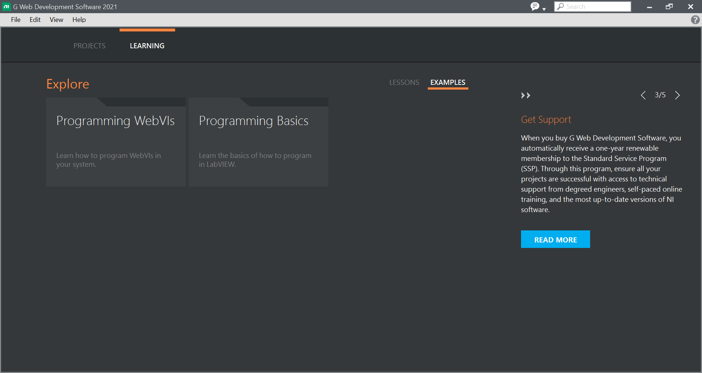

# Programming Basics

These examples teach the basics of how to program in the G programming language. These examples are better viewed in G Web Development Software and can be found in "Learning>>Examples>>Programming Basics" as shown below:

## Arrays

### Array To Cluster

Demonstrates the Array to Cluster node.

### Build Array

Demonstrates how the Build Array node operates in two different modes: concatenate and append.

### Replace Array Elements

Demonstrates the use of the Replace Array Subset node.

### Separate Array Values

Demonstrates iterating through elements of a one-dimensional array and building two output arrays, one of which contains all the elements above zero and one that contains all the elements less than or equal to zero.

## Booleans

## Boolean Logic

Demonstrates how the And node operates with different data types.

## Comparision

### Compare Character Types

Demonstrates the functionality of the character comparison nodes.

### Comparison Nodes

Demonstrates how the Equal? node operates with different data types.

### In Range and Coerce

Demonstrates how the In Range and Coerce node operates with different data types.

### Max And Min

Demonstrates how the Max & Min node operates with different data types.

## Controls and Indicators

### Basic Graph

Demonstrates how to normalize multiple waveforms to display on the same graph.

## Numerics

### Numeric Functions

Demonstrates how the Add node operates with different data types.

## Strings

### Concatenate Strings

Demonstrates how the Concatenate Strings node operates with different data types.

### Extract Numbers With Match Pattern

Demonstrates how to use the Match Pattern node to extract numeric values from a string.

### String Length

Demonstrates how the String Length node operates with different data types.

### Unflatten From JSON

Demonstrates the LabVIEW JSON (JavaScript Object Notation) parser by flattening a cluster to JSON then unflattening it back into multiple pieces.

## Structures

### Disable Structure

Demonstrates how you can use a Disable Structure to comment out a section of code on the diagram.

### Loop Tunnel Modes

Demonstrates the use of indexing and non-indexing tunnels.

### Simple Case Structure

Demonstrates using a Case Structure with several data types.

### Simple For Loop

Demonstrates how to use a For Loop to execute the same code multiple times.
