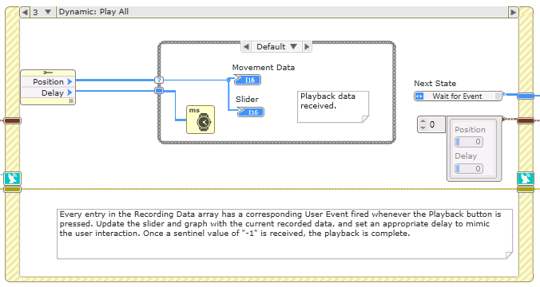
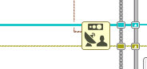

# User Event Generation

This example demonstrates the use of the User Event nodes to implement a user interaction recorder.

1. Run the VI.
2. Drag the value of the Slider control around for a few seconds.
3. Click the Playback button. The exact sequence of drags that you performed will be repeated on the Slider and displayed in the Movement Data graph.
4. Click Stop to stop the VI.

# Dependencies
- LabVIEW NXG Web Module

# Setup
1. Clone the [ni/webvi-examples](https://github.com/ni/webvi-examples) repository to your machine.
2. Open `UserEventGeneration\UserEventGeneration.lvproject`
3. Open `User Event Generation.gviweb` and click the **Run** button.
4. Build the web application.  
  a. Open `WebApp.gcomp`.  
  b. On the **Document** tab, click **Build**.

**Note:** To view the build output on your machine, click **Locate Directory in Windows Explorer** on the **Document** tab once your application finishes building. You can automatically launch and view the Web application locally by going to **System Designer** >> **Web Server** >> right-click **WebApp.gcomp** >> **Run**

# Hosting
You can manually the move the build output found at `\UserEventGeneration\Builds` to any web server. This project also includes a Distribution (WebApp.lvdist) that can be used to build a package (.nipkg). Packages utilize NI Package Manager to automated the process of installing, upgrading, or removing the web app. A package is also a requirement for hosting a Web application on SystemLink Cloud.

## SystemLink Cloud Web App Hosting
The following steps can be used to host the web app on SystemLink Cloud
1. Open `UserEventGeneration.lvproject`.
2. Open `WebApp.lvdist`.
3. Click the build icon in the top command bar of this distribution document
4. Open a Web browser and navigate to https://systemlinkcloud.com/
5. Click the **Choose nipkg** button and select the nipkg built in step 3.
6. When the upload is complete, click on your newly uploaded Web app from your list of Web apps

## Local Hosting
The following steps can be used to host the web app on a local web server
### Hosting on the NI Web Server with a nipkg
1. Open `UserEventGeneration.lvproject`
2. Open `WebApp.lvdist`.
3. Click the build icon in the top command bar of this distribution document
4. Double-click the nipkg and follow the on screen instructions
5. Open a web browser and navigate to `http://localhost:9090/UserEventGeneration/User%20Event%20Generation.html`

### Hosting on the NI Web Server by manually moving files
1. Open `C:\Program Files\National Instruments\Shared\Web Server\htdocs`
2. Copy the `WebApp_Web Server` directory into the `htdocs` directory
3. Open a web browser and navigate to `http://localhost:9090/WebApp_Web%20Server/User%20Event%20Generation.html`

### Hosting on the LabVIEW 2009-2017 Web Server
1. Open `C:\Program Files (x86)\National Instruments\Shared\NI WebServer\www`
2. Copy the `WebApp+Web Server` directory into the `www` directory
3. Open a web browser and navigate to `http://localhost:8080/WebApp_Web%20Server/User%20Event%20Generation.html`

# Details
This WebVI uses value changed events and User Events to record users input to a Slider and allowing the user to play the recording back on the Slider and a Graph. Both of these types of events get "handled" by an Event Structure in the WebVI.

The Event Structure allows a WebVI to respond asynchronously to input. In the case of this WebVI, Value Changed events are used to respond to changes in the Slider's value, clicking the Playback button, and clicking the Stop button. Furthermore, when the Playback button is pressed, the recorded values of the Slider are used to generate a series of User Events (as seen below), which are then handled by the Event Structure to display the values on the Slider and Graph.

